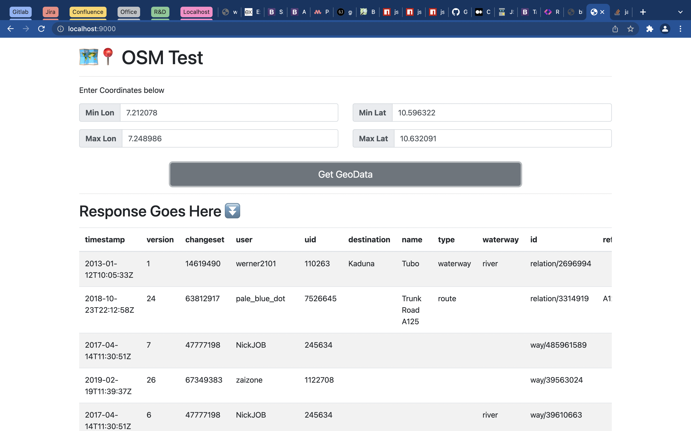
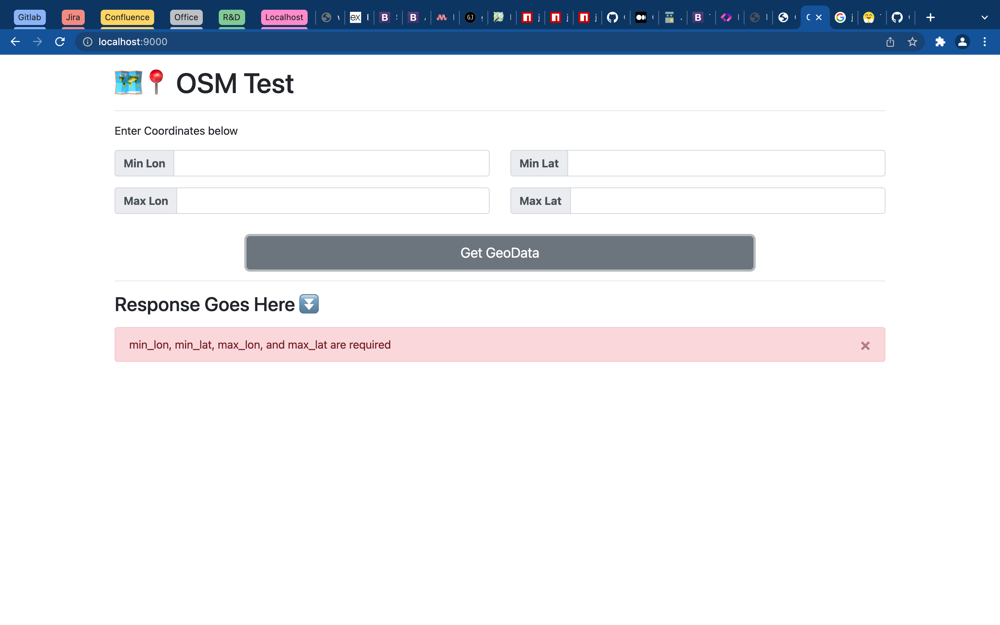

# geotest 🗺📍
> Exploring use of the open street maps api to display features
> of an enclosed geo box (bounding box)

## Usage 🍷
### Install dependencies ⬇️
```bash
yarn install
```

### Test 🧪
```bash
yarn test
```

### Start 🚀
This solution features a http server, which must be run on a port.
Specify your preferred port by running as follows
```bash
PORT=<PORT> yarn start
```
> When port is not set, application resolves to 9000.

Client application is can be accessed at `http://<your_host>:<your_port ?? 9000>/`
Ex: `http://localhost:9000/`. See screenshots of usage below.

#### Shots 📸
> Successful Usage


> Usage with errors


## Api 🔥
The solution also exposes an API interface

### Get OSM GeoJSON
- Endpoint: `/osm/get`
- Method: `GET`
- Query Params: `min_lon`, `min_lat`, `max_lon`, `max_at`
